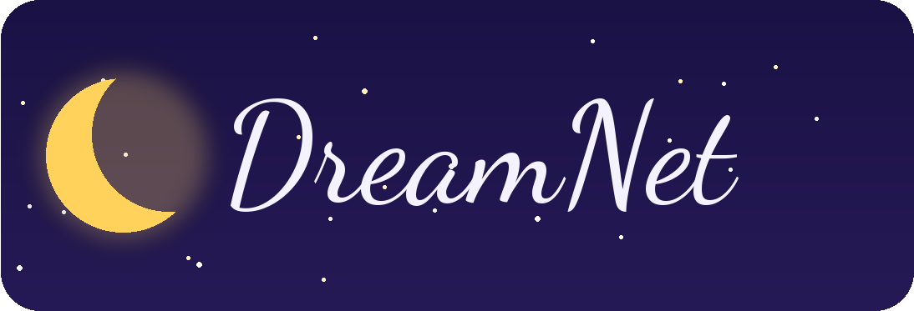

<div align="center">



# 🍄 DreamNet

**A cozy social dream journal — where dreams can be saved, shared, rated, and commented on by other dreamers — with a playful 3D "Dream World" you can wander to rate dreams as floating bubbles.**

[](https://nextjs.org)
[](https://www.typescriptlang.org)
[](https://react.dev)
[](https://www.prisma.io)
[](https://neon.tech)
[](https://next-auth.js.org)
[](https://tailwindcss.com)
[](https://threejs.org)

[](https://github.com/kithrine/dreamnet)
[](https://github.com/kithrine/dreamnet)

</div>

---

DreamNet is a full-stack web app for **sharing the dreams you have at night**. Sign up, write down a dream, and it joins a shared feed where other people can **rate it**, **comment on it**, and **tag it**. The more your dreams resonate, the more **stars** you earn. On top of the classic feed, DreamNet has a playful **3D Dream World** — a floating island you explore with a little avatar, where unrated dreams drift by as glowing bubbles you pop with a wand to rate them.

> **The assignment:** *"Dreams can now be saved, shared, rated, and commented on by other people."* DreamNet is our take on that brief — the core journal plus an extra, optional game layer for fun.

## ✨ Tech Stack

| Layer | Technology |
| ----- | ---------- |
| **Framework** | Next.js 16 (App Router · Turbopack) |
| **Language** | TypeScript (strict — no `any`, no `var`) |
| **UI** | React · Tailwind CSS (custom dream-themed design tokens) |
| **3D / Game** | Three.js · React Three Fiber · @react-three/drei |
| **Database** | PostgreSQL on Neon |
| **ORM** | Prisma 7 (with the `@prisma/adapter-pg` adapter) |
| **Auth** | NextAuth.js (Credentials + bcrypt, JWT sessions) |
| **Hosting** | Vercel-ready (Next.js serverless) |

## 👥 Authors

DreamNet was built by **Jacqueline** and **Kit** as a two-person project, working in one shared repository on separate branches and reviewing each other's work before merging.

- **Kit** built the **backend and the main app** — the Prisma schema and database, authentication, the API routes, the home feed, the rating and comment components, and the shared navigation.
- **Jacqueline** built the **3D Dream World game** — the avatar gallery, the floating-island scene, the dream-bubble rating loop, and the in-game leaderboard — wiring it into Kit's real API contract.

We divided the surface area cleanly (backend/feed vs. game), agreed on the data shapes up front (the `Dream`, `Rating`, and `User` models and the `/api/game` routes), and kept everything on feature branches so `main` always stayed working. When one side needed something from the other — like the random-dream and rate endpoints the game calls — we sorted out the contract together first, then built to it.

## 🗺️ Features

DreamNet is organized into a few core areas:

| Area | What it does |
| ---- | ------------ |
| 🌙 **Dream Feed** | The home page — browse, open, and read dreams shared by everyone. |
| ✍️ **Share a Dream** | Write a dream (title + content) and post it to the shared feed. |
| ⭐ **Rate Dreams** | Give any dream (except your own) a 1–5 star rating; the author earns stars. |
| 💬 **Comments** | Discuss and react to dreams in the comment thread. |
| 🏷️ **Tags** | Dreams can be tagged (e.g. *flying*, *lucid*, *weird*) for discovery. |
| 🔭 **Explore** | Find dreams, dreamers, and tags. |
| 🔔 **Activity** | A notifications view for ratings and interactions. |
| 👤 **Profile** | Your dreams, your stats, and your total stars. |
| 🎮 **Dream World (3D)** | A floating-island mini-game: wander with an avatar and pop drifting dream-bubbles to rate them, with a leaderboard of top "poppers." |

## 🎮 Inside the Dream World

The optional game layer is its own corner of the app at `/game`:

- **Avatar gallery** — pick one of ten dreamer characters (owl, wizard, fox, knight, dragonling, **mushroom** 🍄, turquoise dino, bunny, frog, robot) and a color, then enter.
- **Floating islands** — a connected, walkable dreamscape with bridges, glowing flowers, drifting clouds, and a starfield.
- **Pop to rate** — unrated dreams float by as colored bubbles; aim your wand, fire a stream of stars, and the bubble bursts into a slow, whimsical shower before the rating panel opens.
- **Leaderboard** — climb the "Top Poppers" board as you rate more dreams.

> The avatar choice is just for the play session — it never changes your real account avatar.

## 🚀 Setup

You'll need [Node.js](https://nodejs.org) and a [Neon](https://neon.tech) (PostgreSQL) database.

### 1. Install dependencies

```
npm install
```

### 2. Configure environment

Create a `.env.local` file in the project root:

```
DATABASE_URL=your_neon_postgres_connection_string
NEXTAUTH_SECRET=your_random_secret
NEXTAUTH_URL=http://localhost:3000
```

### 3. Set up the database

```
npx prisma generate
npx prisma migrate dev
```

> Note: `prisma db seed` resets the database first — only run it against a database you're sure about, and coordinate before seeding a shared one.

### 4. Run the dev server

```
npm run dev
```

Open [http://localhost:3000](http://localhost:3000), sign up, and start sharing dreams. The Dream World lives at `/game`.

## 📁 Project Structure

```
dreamnet/
├── app/
│   ├── (home/feed pages)        # Dream feed, explore, activity, profile
│   ├── api/
│   │   └── game/
│   │       ├── dreams/random/   # GET a random unrated dream (for the game)
│   │       └── dreams/[id]/rate # POST a 1–5 rating
│   └── game/                    # The 3D Dream World
│       ├── page.tsx             # Gallery → world orchestrator
│       ├── AvatarGallery.tsx    # Character + color picker
│       ├── avatarBuilders.ts    # Three.js builders for the 10 avatars
│       ├── gameData.ts          # Types, world constants, API helpers
│       ├── DreamWorld.tsx       # The scene: islands, bubbles, effects
│       └── sounds.ts            # Web Audio sound effects
├── components/                  # Shared UI (nav, dream cards, rating, comments)
├── lib/
│   ├── prisma.ts                # Prisma client (Neon adapter)
│   └── auth.ts                  # NextAuth config
├── prisma/
│   ├── schema.prisma            # User, Dream, Rating, Tag, Comment, …
│   └── seed.ts                  # Seed data
└── package.json
```

## 🎨 Design Decisions

### Why a separate 3D game layer?

- **Fun without risk** — the game reads and writes through the same public API as the rest of the app, so it can't get the data model out of sync.
- **Session-only avatars** — your in-game character is just for play; it never touches your saved account, so experimenting is free.
- **Clean ownership** — keeping the game in `app/game/` let two people build in parallel without stepping on each other.

### Why agree on the API contract first?

- The game and the backend are built by different people, so we locked down the request/response shapes (`/api/game/dreams/random` and `/rate`) before coding, and built to that contract on both sides.

### Why Prisma + Neon?

- **Type-safe data** — Prisma generates TypeScript types straight from the schema, so the whole app shares one source of truth.
- **Serverless-friendly Postgres** — Neon pairs well with Next.js on serverless hosting.

---

<div align="center">

### ⭐ Star this project if you found it helpful!

[](https://github.com/kithrine/dreamnet)

**Built with 💜 by Jacqueline & Kit**

</div>
